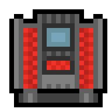

# Changelog

CFallSave Changelog

# Summary

* [`v2.0.0`](#v200-20250714)
* [`v2.0.0-RC2`](#v200-rc2-20250620)
* [`v2.0.0-RC1`](#v200-rc1-20250530)

# [`v2.0.0` `(2025/07/14)`](https://github.com/reallukee/cfallsave/releases/tag/v2.0.0)

## Added

* Documentation

## Changed

* `malloc` -> `calloc`
* Makefiles

## Removed

*Nothing*

# [`v2.0.0-RC2` `(2025/06/20)`](https://github.com/reallukee/cfallsave/releases/tag/v2.0.0-rc2)

## Added

* Examples

## Changed

* Bug fixing
* Makefiles

## Removed

*Nothing*

# [`v2.0.0-RC1` `(2025/05/30)`](https://github.com/reallukee/cfallsave/releases/tag/v2.0.0-rc1)

## Added

* Everything

## Changed

*Nothing*

## Removed

*Nothing*
