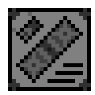

# Documentation

CFallSave Documentation

 

> [!NOTE]
> The documentation is updated!

<!--
> [!WARNING]
> The documentation is incomplete!
-->

<!--
> [!CAUTION]
> The documentation is outdated!
-->

# Summary

* [APIs](#apis)
  * [C APIs (CFallSave)](#c-apis-cfallsave)
  * [C++ APIs (CFallSave++)](#c-apis-cfallsave-1)
* [Save Formats](#save-formats)

# APIs

## C APIs (CFallSave)

* [CFallSave API](./docs/cfallsave.md)
* [*Fallout 1* C API](./docs/api_fo1.md)
* [*Fallout 2* C API](./docs/api_fo2.md)
* [*Fallout Tactics: Brotherhood of Steel* C API](./docs/api_fotbos.md)
* [*Fallout 3* C API](./docs/api_fo3.md)
* [*Fallout: New Vegas* C API](./docs/api_fonv.md)
* [*Fallout 4* C API](./docs/api_fo4.md)

## C++ APIs (CFallSave++)

* [CFallSave++ API](./docs/cfallsave++.md)
* [*Fallout 1* C++ API](./docs/api_cplusplus_fo1.md)
* [*Fallout 2* C++ API](./docs/api_cplusplus_fo2.md)
* [*Fallout Tactics: Brotherhood of Steel* C++ API](./docs/api_cplusplus_fotbos.md)
* [*Fallout 3* C++ API](./docs/api_cplusplus_fo3.md)
* [*Fallout: New Vegas* C++ API](./docs/api_cplusplus_fonv.md)
* [*Fallout 4* C++ API](./docs/api_cplusplus_fo4.md)

# Save Formats

* [*Fallout 1* Save Format](./docs/save_format_fo1.md)
* [*Fallout 2* Save Format](./docs/save_format_fo2.md)
* [*Fallout Tactics: Brotherhood of Steel* Save Format](./docs/save_format_fotbos.md)
* [*Fallout 3* Save Format](./docs/save_format_fo3.md)
* [*Fallout: New Vegas* Save Format](./docs/save_format_fonv.md)
* [*Fallout 4* Save Format](./docs/save_format_fo4.md)
