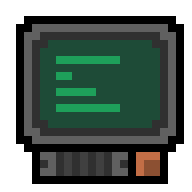

# ToDo

CFallSave ToDo

# Summary

* [Features](#features)
* [Ideas](#ideas)

# Features

- [x] Common Reader
- [ ] Common Writer
- [x] Documentation (*Markdown*)
- [ ] Documentation (*Doxygen*)
- [x] Save Reading
- [ ] Save Writing
- [x] *Fallout 1* Support
- [x] *Fallout 2* Support
- [x] *Fallout 3* Support
- [x] *Fallout: New Vegas* Support
- [x] *Fallout 4* Support
- [x] *Fallout Tactics: Brotherhood of Steel* Support
- [ ] Generic Fallout Reader (FOX)
- [ ] Generic Fallout Writer (FOX)
- [ ] Generic Fallout Reader (FOX) C++
- [ ] Generic Fallout Writer (FOX) C++
- [ ] More support for *Fallout 1*
- [ ] More support for *Fallout 2*
- [ ] More support for *Fallout 3*
- [ ] More support for *Fallout: New Vegas*
- [ ] More support for *Fallout 4*
- [ ] More support for *Fallout Tactics: Brotherhood of Steel*
- [x] Read Property
- [x] Write Property
- [x] Get Property
- [x] Set Property
- [ ] Reader Documentation
- [ ] Writer Documentation

# Ideas

- [ ] Not Generic Read Property
- [ ] Not Generic Write Property
- [ ] Not Generic Get Property
- [ ] Not Generic Set Property
- [ ] Reader C++ Wrapper
- [ ] Writer C++ Wrapper
