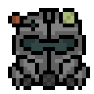

<div align="center">



# *Fallout 4*<br /> C++ Examples

[Back to Examples](../EXAMPLES.md)

</div>


# Summary

* [Read Save](#read-save)
* [Read Save (From `FO4SAVE`)](#read-save-from-fo4save)


# Read Save

## Source

```cpp
#include <iostream>
#include <cfallsave++.hpp>

using namespace std;
using namespace cfallsavepp;

int main(int argc, char* argv[])
{
    string saveName = "fo4.fos";

    if (!FO4Save::isSave(saveName))
    {
        return 1;
    }

    FO4Save* save = new FO4Save(saveName);

    if (!save->isOpen())
    {
        return 1;
    }

    save->print();

    delete save;

    return 0;
}
```

## Documentation

* [`FO4Save`](../docs/api_cplusplus_fo4.md#fo4save)
* [`FO4Save::isSave`](../docs/api_cplusplus_fo4.md#fo4saveissave-static)
* [`FO4Save::FO4Save`](../docs/api_cplusplus_fo4.md#fo4savefo4save)
* [`FO4Save::isOpen`](../docs/api_cplusplus_fo4.md#fo4saveisopen)
* [`FO4Save::printSave`](../docs/api_cplusplus_fo4.md#fo4saveprintsave)
* [`FO4Save::~FO4Save`](../docs/api_cplusplus_fo4.md#fo4savefo4save-1)


# Read Save (From `FO4SAVE`)

## Source

```cpp
#include <iostream>
#include <cfallsave++.hpp>

using namespace std;
using namespace cfallsavepp;

int main(int argc, char* argv[])
{
    string saveName = "fo4.fos";

    const char* c_saveName = saveName.c_str();

    if (!isFO4Save(c_saveName))
    {
        return 1;
    }

    FO4SAVE* save = readFO4Save(c_saveName);

    if (!isFO4SaveOpen(save))
    {
        return 1;
    }

    FO4Save* savepp = new FO4Save(save);

    savepp->print();

    delete savepp;

    return 0;
}
```

## Documentation

* [`FO4SAVE`](../docs/api_fo4.md#fo4save)
* [`isFO4Save`](../docs/api_fo4.md#isfo4save)
* [`readFO4Save`](../docs/api_fo4.md#readfo4save)
* [`isFO4SaveOpen`](../docs/api_fo4.md#isfo4saveopen)
* [`FO4Save`](../docs/api_cplusplus_fo4.md#fo4save)
* [`FO4Save::printSave`](../docs/api_cplusplus_fo4.md#fo4saveprintsave)
* [`FO4Save::~FO4Save`](../docs/api_cplusplus_fo4.md#fo4savefo4save-1)
